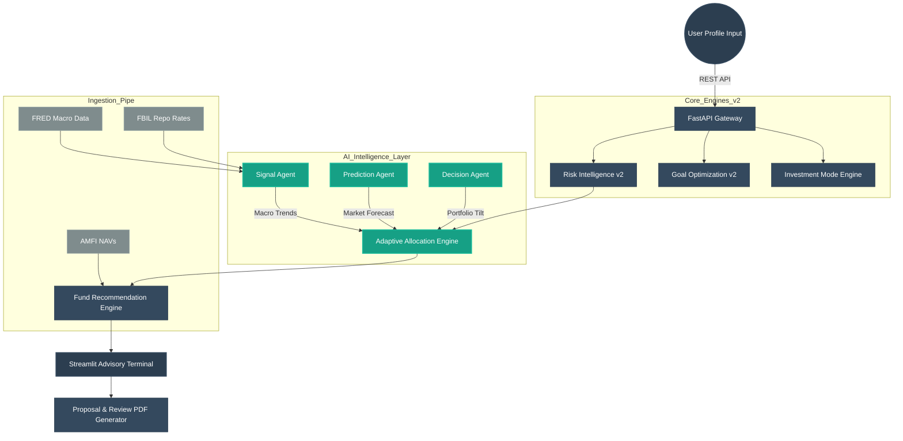
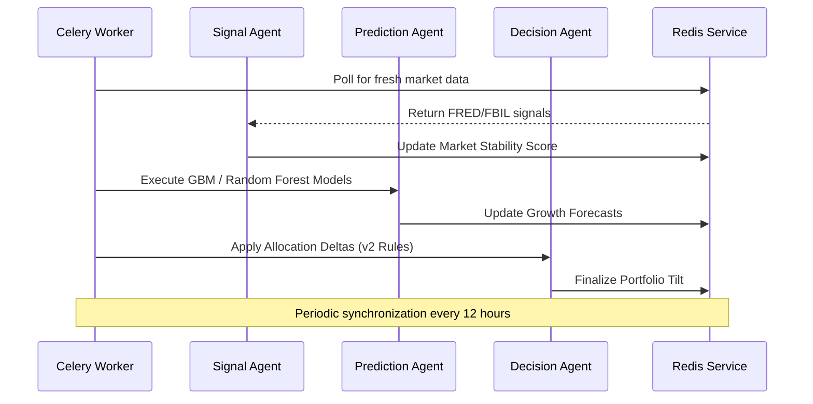

# AI-Powered Mutual Fund Advisory & Portfolio Intelligence System

An institutional-grade, AI-driven financial planning and portfolio intelligence engine built for financial advisors. The system integrates Modern Portfolio Theory (MPT), Monte Carlo simulations, real-time macroeconomic signals, and an explainable advisory workflow to deliver personalized, goal-oriented investment strategies — with full audit, override, and PDF reporting support.

---

## Technical Overview

The system is designed as a distributed intelligence platform, utilizing a multi-layered architecture to process user profiles, market signals, and fund performance data. Version 2.0 introduces a centralized engine routing system, expanded financial goal types, and market-aware investment deployment logic. The advisory layer is built around the Vinsan Financial Services PoC requirements: transparent recommendations, editable proposals, version-controlled drafts, and presentation-quality PDF output.

## System Architecture

### Distributed Intelligence Flow



### Async Agent Orchestration



---

## Advisory Workflow

The system is built around an 8-step advisor-led workflow:

```
1. Create client profile
2. Capture financial, goal, and risk data
3. (Optional) Process meeting notes via AI extraction
4. Generate system recommendation
5. Advisor reviews, edits, and logs overrides
6. Finalize and approve proposal
7. Generate PDF report (Proposal Deck or Review Report)
8. Store all records for audit and compliance
```

---

## Core Intelligence Modules

### 1. Risk Intelligence Engine (v2.0)
- **Factor Analysis**: Evaluates age-based risk capacity, dependency ratios, and behavioral traits.
- **XAI (Explainable AI)**: Granular breakdown of score contributions with narrative explanations.
- **Behavioral Normalization**: Maps qualitative inputs to quantitative risk vectors (0.0–10.0).
- **Advisor Override**: Risk classification can be overridden with a mandatory reason, persisted to the audit log.

### 2. Goal Optimization Engine (v2.0)
- **Expanded Goal Types**: Retirement, Child Education, Marriage, Real Estate Purchase, Emergency Fund.
- **Sustainability Planning**: Post-retirement income via annuity corpus and withdrawal rate calculations.
- **SIP Step-Up Logic**: Recommends incremental increases aligned to inflation-adjusted targets.

### 3. Investment Mode Engine (v2.0)
- **Deployment Strategies**: Recommends SIP, Lumpsum, STP, or SWP based on market conditions.
- **Valuation Guardrails**: Analyzes Nifty P/E and VIX to prevent aggressive deployment at market peaks.

### 4. Adaptive Allocation Layer
- **Macro-Aware Rebalancing**: Tilts weights between Equity, Debt, and Gold based on live macro signals.
- **Feature-Flag Control**: Engine routing via `config.py` for seamless v1/v2 switching.

### 5. Proposal Builder & Version Control
- **Editable Drafts**: Advisors edit rationale, SIP illustrations, and benchmark tables before finalizing.
- **Version History**: Every save creates a new version; all versions are queryable.
- **System vs Advisor Comparison**: Side-by-side diff view of system-generated vs advisor-modified proposal with delta indicators.
- **Approval Workflow**: `draft → reviewed → approved → issued` status pipeline.

### 6. Advisor Override System (DB-Persisted)
- Overrides are stored in the `advisor_overrides` table with full lifecycle tracking (`pending → approved/rejected`).
- Rule-based guardrails applied automatically: age >55 enforces minimum 40% debt; risk score <4 caps equity at 30%.
- Every override creation writes an `AuditLog` entry.

### 7. PDF Report Generation
- **Proposal Deck** (`proposal_deck`): Standard advisor presentation with SIP illustrations, benchmark comparison, rationale, and disclaimer.
- **Vinsan Presentation Deck** (`vinsan_proposal`): Branded deck with firm name, advisor phone, and styled cover page.
- **Periodic Review Report** (`review_report`): Portfolio snapshot vs last issued proposal, activity timeline, and advisor commentary.

### 8. Meeting Notes & AI Extraction
- Paste raw meeting transcripts; the system extracts age, SIP expectations, goals, risk signals, and current investments via regex + confidence scoring.
- Confidence levels (high/medium/low) shown per field; advisor approves before applying to client profile.

### 9. Audit Trail
- Full chronological history of all inputs, recommendations, advisor edits, overrides, and issued reports.
- Before/after JSON diffs for every change.
- Accessible per-client and globally (admin view).

### 10. Client Portal
- Read-only portal for clients to view and download their issued proposals.
- Access via shareable URL: `http://<host>:8501/?view=portal&client_id=<ID>`
- No advisor login required; clients see only their own issued reports.

---

## Mathematical Foundations

- **Modern Portfolio Theory (MPT)**: Baseline asset allocation optimized for the efficient frontier relative to the user's risk profile.
- **Monte Carlo Simulations**: 1,000+ iterations to determine probability of success for financial goals.
- **Geometric Brownian Motion (GBM)**: Used by prediction agents to forecast market trajectories.
- **Inflation Indexing**: Continuous adjustment of goal targets using live CPI data.

---

## Technical Stack

- **Backend**: FastAPI, Celery (distributed processing)
- **Frontend**: Streamlit, Plotly
- **Database**: PostgreSQL via SQLAlchemy ORM (Neon Cloud)
- **Cache / Broker**: Redis
- **Quantitative**: Pandas, NumPy, SciPy, Scikit-learn, yfinance
- **Reporting**: WeasyPrint + Jinja2 HTML templates

---

## Installation and Configuration

### Prerequisites
- Python 3.10+
- Redis (for Celery and caching)
- PostgreSQL (or Neon Cloud connection string)

### Setup

```bash
git clone <repository-url>
cd mutual-fund-advisory
python -m venv .venv
source .venv/bin/activate
pip install -r requirements.txt
```

Configure `.env`:
```
DATABASE_URL=postgresql://...
SECRET_KEY=...
ADMIN_SECRET=...
ENVIRONMENT=development
```

Feature flags in `config.py`:
```python
FEATURE_FLAGS = {
    "v2_risk_explanation": True,
    "advanced_goal_types": True,
    "investment_mode_recommendation": True,
    "advanced_products": False,
}
```

### Running

```bash
# Backend API
uvicorn backend.api.main:app --reload
# http://localhost:8000

# Celery worker
celery -A ai_agents.tasks worker --loglevel=info

# Frontend
streamlit run frontend/app.py
# http://localhost:8501
```

---

## Repository Structure

```text
├── ai_agents/                  # Celery workers and multi-agent orchestration
├── ai_layer/                   # Signal processing and adaptive allocation logic
├── backend/
│   ├── api/
│   │   ├── main.py             # FastAPI routes (clients, proposals, overrides, portal, review)
│   │   ├── advisor_overrides.py# DB-backed override API + rule-based guardrails
│   │   └── report_generator.py # Report data assembly helpers
│   ├── core/                   # Advisory orchestrator, confidence engine, guardrails
│   ├── database/
│   │   └── models.py           # SQLAlchemy models (Advisor, Client, ProposalDraft,
│   │                           #   AdvisorOverride, AuditLog, IssuedReport, ...)
│   ├── engines/                # Versioned quantitative engines (v1/v2)
│   ├── report/
│   │   ├── pdf_generator.py    # WeasyPrint PDF generation (proposal, vinsan, review)
│   │   ├── proposal_deck.html  # Standard proposal deck template
│   │   ├── vinsan_proposal.html# Branded advisor presentation template
│   │   └── review_report.html  # Periodic review report template
│   └── services/
│       └── ai_note_extractor.py# Regex-based meeting transcript parser
├── frontend/
│   ├── app.py                  # Main Streamlit app (auth, portal routing, tab layout)
│   ├── api_client.py           # HTTP client for all backend endpoints
│   └── components/
│       ├── dashboard.py        # Intelligence dashboard
│       ├── input_form.py       # Client profile form
│       ├── meeting_notes.py    # AI meeting note extraction UI
│       ├── portfolio_snapshot.py # Holdings entry and concentration analysis
│       ├── proposal_builder.py # Proposal edit / compare / approve / issue
│       ├── review_report.py    # Periodic review report generation UI
│       ├── audit_trail.py      # Audit history viewer
│       ├── global_dashboard.py # Advisor-level KPI dashboard with proposal counts
│       └── client_portal.py    # Read-only client proposal viewer
├── data/cache/                 # JSON caches for market, macro, and signals
├── tests/                      # Test suite
└── config.py                   # Feature flags and system configuration
```

---

## API Reference (Key Endpoints)

| Method | Endpoint | Description |
|--------|----------|-------------|
| `POST` | `/auth/login` | Advisor login |
| `GET/PUT` | `/auth/me/profile` | Get / update advisor branding (firm, phone, logo) |
| `GET/POST` | `/clients/` | List / create clients |
| `GET` | `/clients/proposal-counts` | Proposal count per client (dashboard KPI) |
| `POST` | `/clients/{id}/proposals` | Create versioned proposal draft |
| `POST` | `/clients/{id}/proposals/{pid}/approve` | Approve proposal |
| `POST` | `/clients/{id}/proposals/{pid}/issue` | Generate and issue PDF report |
| `GET` | `/clients/{id}/issued-reports` | List issued reports |
| `POST/GET` | `/clients/{id}/overrides` | Create / list advisor overrides |
| `POST` | `/clients/{id}/overrides/{oid}/approve` | Approve override |
| `POST` | `/clients/{id}/overrides/{oid}/reject` | Reject override with reason |
| `POST` | `/clients/{id}/review-report` | Generate periodic review PDF |
| `POST` | `/clients/{id}/meeting-notes` | Save meeting note |
| `GET` | `/audit-trail` | Global audit trail (admin: all clients) |
| `GET` | `/portal/client/{id}/reports` | Public endpoint for client portal |

---

## Acceptance Criteria (Vinsan PoC)

- Client profile creation is quick and form-driven
- Risk and goal outputs show clear reasoning
- Proposal can be generated, edited, compared (system vs advisor), and approved
- Professional PDF is exportable (proposal deck, branded deck, review report)
- Audit trail is visible per client and globally
- Advisor overrides are persisted, traceable, and reversible
- AI meeting notes produce structured output with confidence indicators
- Clients can view issued proposals via a shareable portal link
